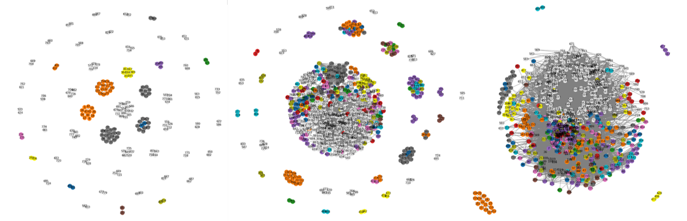
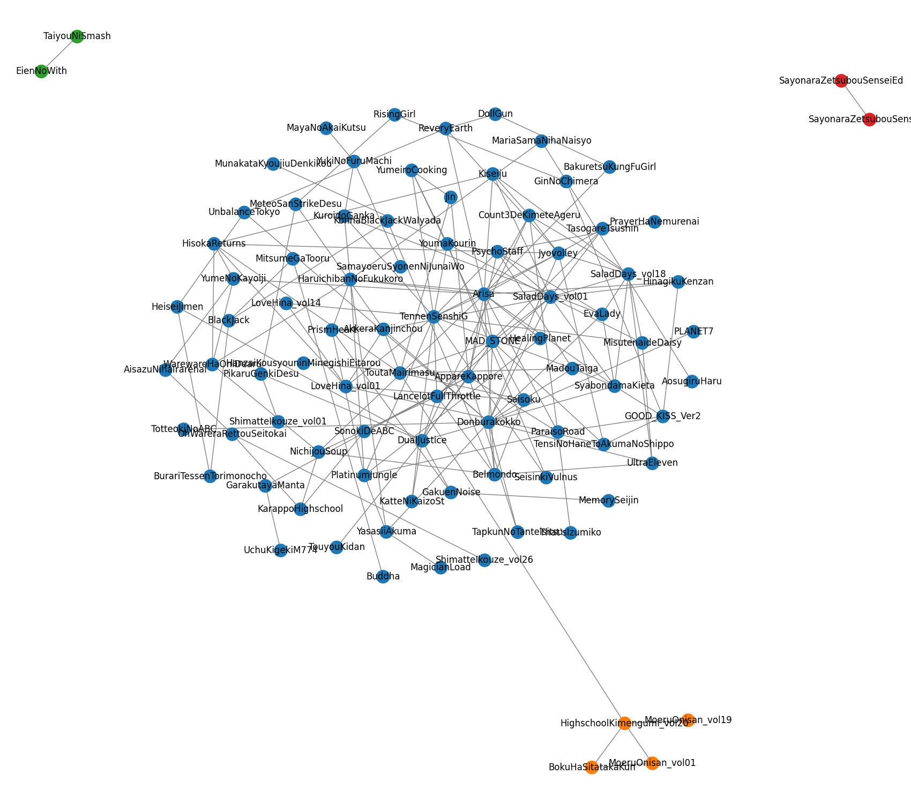

# PalsGraph: a module for use with NetworkX to display communities in graph
PalsGraph provides three methods to enable easy use of [NetworkX](https://networkx.org/) to display the communities discovered in a graph.

* make\_graph: Create a NetworkX graph with labels
* getpos: Calculate the optimal positions for visualizing the graph nodes based on the communities
* gen\_colormap: Generate a colormap where each community is given a unique color



PalsGraph is made to integrate seamlessly with NetworkX so that you can use all the features in NetworkX for your network analysis needs.

## Pre-requirements
* python3
* numpy>=1.16.1
* networkx
* seaborn
* pybind11~=2.6.1 (if there is no wheel/binary for your platform and you need to compile from source)

## Installation

### Installation with pip
To install with pip, run the following from a terminal:
```Bash
pip install palsgraph
```

### Installation from Github
To clone the repository and install manually, run the following from a terminal:
```Bash
git clone https://github.com/kalngyk/palsgraph.git
cd palsgraph
python setup.py install
```

## Usage

### Quick start
The following codes demonstrates how to use the three functions provided by PalsGraph.

Assume that we have a distance matrix of some entities in `distmat`, with the labels of the entities in `labels`, where `labels` is sorted according to the entities' indices in `distmat`.

The following constructs a NetworkX graph from `distmat` and `labels`. A label-less graph is created if `labels=None`. Disconnected vertices (vertices that are not connected to any other vertex) will not be shown if `show_singletons=False`.

```Python
import palsgraph
G = palsgraph.make_graph(distmat, labels=labels, show_singletons=False)
```
Then, suppose we use a method in NetworkX to discover the communities in `G`. (In the following, Girvan-Newman is used.)
```Python
import networkx as nx
comp = nx.algorithms.community.centrality.girvan_newman(G)
```
NetworkX will return several possible ways to organize the graph into communities. Each possibility is a list of lists. For example, `({'A'}, {'B', 'C'}, {'D', 'E'})`. In which case, the node `'A'` forms a community, `'B'`, `'C'` form another, and `'D'`, `'E'` likewise form another community.

The following codes show how each possibility can be enumerated (using islice) and visualized using PalsGraph. The `communities` input given to `palsgraph.getpos` and `palsgraph.gen_colormap` should be a list of lists, such as `({'A'}, {'B', 'C'}, {'D', 'E'})` or `[['A'], ['B', 'C'], ['D', 'E']]`.
```Python
import matplotlib.pyplot as plt
from itertools import islice
max_shown = 3
shown_count = 1
for communities in islice(comp, max_shown): # For each possible set of communities

    # Find optimal positions for displaying the communities in the graph
    pos = palsgraph.getpos(G, communities)

    # Generate a colormap
    color_map = palsgraph.gen_colormap(G, communities)

    # Draw graph and save to output file
    plt.figure(figsize=(17, 15))
    nx.draw(G, pos=pos, node_color=color_map, edge_color='grey', with_labels=True)
    outfilename = 'graph-' + str(shown_count) + '.png'
    plt.savefig(outfilename)

    shown_count += 1
```

If you implement your own community detection algorithm, just output the communities in the form of a list of lists. Then, you can use PalsGraph as follows.
```Python
# Call your own community detection algorithm
communities = my_community_detection_algo(G)

# Find optimal positions for displaying the communities in the graph
pos = palsgraph.getpos(G, communities)

# Generate a colormap
color_map = palsgraph.gen_colormap(G, communities)

# Draw graph and save to output file
plt.figure(figsize=(17, 15))
nx.draw(G, pos=pos, node_color=color_map, edge_color='grey', with_labels=True)
plt.savefig('mygraph.png')
```

### Sample output
The following gives an example of the graphs generated using PalsGraph. Note that the graph connectedness is as given in the distance matrix, but the colors and positions are based only on the communities discovered. In this example, the communities discovered are mainly in accordance with the connectedness of graph structure, except for a few vertices (near the bottom of the graph).



## Help
If you have any questions or require assistance using PalsGraph, please contact us at kalngyk@gmail.com.

## Credits
PalsGraph is written by Yujin Yao and Yen Kaow Ng under the supervision of Honwai Leong.
